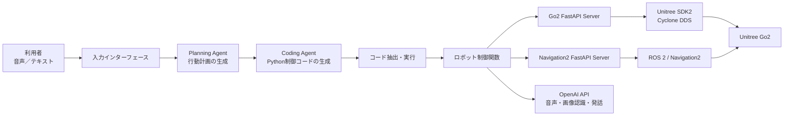

# Plan Coding Agent

自然言語の指示からロボットの行動計画を立案し、その計画を実行するためのPython制御コードを生成・実行するAIエージェントを実装したリポジトリです。

対象ロボットはUnitree Go2です。利用者は音声またはテキストで目的を指示するだけで、AIエージェントが利用可能なロボット機能と登録済みウェイポイントを考慮して具体的な手順へ分解し、Go2の基本動作、発話、カメラ画像の認識、Navigation2による自律移動などを組み合わせた制御コードを生成します。

各コマンドは、特に記載がない限りリポジトリのルートディレクトリで実行してください。

## AIエージェントの処理フロー

自然言語の入力は、次の流れでロボットの動作へ変換されます。

1. 音声またはテキストから利用者の指示を受け取ります。
2. Planning Agentが指示の目的と前提条件を整理し、利用可能な機能だけを使った行動計画を作成します。
3. Coding Agentが行動計画を、ロボット制御関数を呼び出すPythonコードへ変換します。
4. 生成されたコードを抽出して一時スクリプトを作成し、別のPythonプロセスで実行します。
5. 制御関数がGo2 APIまたはNavigation2 APIを呼び出し、ロボットを動作させます。



生成コードは`plan_coding_agent/functions/`で公開している制御関数を使用するようプロンプトで制約されています。

## システム構成

システムは、主に次のコンポーネントで構成されています。

- **入力インターフェース**: `run_agent.py`がopenWakeWordによるウェイクワード検出と音声認識を担当し、`run_agent_text.py`が対話形式のテキスト入力を受け付けます。
- **Planning Agent**: 自然言語の指示、利用可能なロボット機能、登録済みウェイポイントから、実行可能な行動計画を生成します。
- **Coding Agent**: 行動計画から、移動、発話、画像認識、ナビゲーションなどの関数を組み合わせたPythonコードを生成します。
- **コード実行部**: LLMの応答からPythonコードブロックを抽出し、実行用スクリプトとしてサブプロセスで実行します。
- **ロボット制御関数**: AIエージェントが使用できる機能を`plan_coding_agent/functions/`に定義しています。Go2制御、ナビゲーション、音声、画像認識などを共通のPython関数として提供します。
- **Go2制御API**: FastAPIとUnitree SDK2を使用し、移動、姿勢、ジェスチャー、カメラ画像取得などをGo2へ指示します。
- **ナビゲーションAPI**: FastAPIとROS 2の`rclpy`を使用して、Navigation2への目的地送信と現在位置取得を提供します。
- **外部サービス**: OpenAI APIを行動計画・コード生成、音声認識、音声合成、カメラ画像の認識に使用します。

Go2制御APIとナビゲーションAPIは、AIエージェント本体とは別のプロセスとして起動します。必要に応じて、それぞれをGo2やROS 2へ接続できる別のコンピューター上で実行することもできます。

## 実装済み機能

### AIエージェント

| 機能 | 説明 |
| --- | --- |
| 音声による指示 | ウェイクワードを検出した後、マイクの入力をテキストへ変換してAIエージェントへ渡します。 |
| テキストによる指示 | 対話形式のプロンプトから自然言語の指示を入力できます。 |
| 行動計画の生成 | Planning Agentが指示、利用可能な機能、ウェイポイントをもとに行動手順を作成します。 |
| ロボット制御コードの生成 | Coding Agentが行動計画をPythonの`main`関数へ変換します。 |
| 生成コードの実行 | 生成されたコードを一時スクリプトへ組み込み、別のPythonプロセスで実行します。 |
| 複数機能の組み合わせ | 移動、認識、発話、ナビゲーションなどを一つの行動計画内で組み合わせられます。 |

### Go2の動作制御

| 機能 | AIエージェント用関数 | 説明 |
| --- | --- | --- |
| 移動・旋回 | `walk(x, yaw)` | 指定した角度だけ旋回した後、指定した距離を前進または後退します。 |
| 伏せる | `damp()` | Go2を伏せた状態にします。 |
| 座る | `sit()` | Go2を座らせます。 |
| 立ち上がる | `stand_up()` | Go2を起立状態へ復帰させます。 |
| 手を振る | `wave_hand()` | Go2の挨拶モーションを実行します。 |
| ハートを描く | `draw_heart()` | 前脚でハートを描くモーションを実行します。 |
| ストレッチ | `stretch()` | ストレッチモーションを実行します。 |
| ダンス | `dance()` | ダンスモーションを実行します。 |
| 姿勢角の指定 | Go2 APIの`/api/go2/euler` | roll、pitch、yawを指定して本体姿勢を変更します。 |

移動処理にはUnitree SDK2の障害物回避クライアントを使用しています。各モーションが利用できるかどうかは、Go2本体のファームウェアやSDKの対応状況にも依存します。

### カメラ・AI認識

| 機能 | AIエージェント用関数 | 説明 |
| --- | --- | --- |
| カメラ画像取得 | Go2 APIの`/api/go2/get_image` | Go2のカメラ画像をBase64形式で取得します。 |
| カメラ画像のバイト取得 | Go2 APIの`/api/go2/get_image_bytes` | Go2のカメラ画像をバイト列として取得します。 |
| 画像と条件の一致判定 | `query_camera(query)` | カメラ画像が指定した条件に一致するかをVLMで判定します。 |
| 画像の詳細な分析 | `call_vlm(query)` | カメラ画像と質問をVLMへ渡し、画像の説明や質問への回答を取得します。 |
| テキストの意味判定 | `query_text(text, query)` | 二つのテキストの意味的な内容が一致するかをLLMで判定します。 |
| LLMへの問い合わせ | `call_llm(query)` | 任意の質問をLLMへ渡して回答を取得します。 |

### 音声

| 機能 | AIエージェント用関数 | 説明 |
| --- | --- | --- |
| ウェイクワード検出 | `WakeWord.wait()` | openWakeWordを使用して、音声指示を開始するウェイクワードを待機します。 |
| 音声認識 | `transcribe()` | マイク入力をテキストへ変換します。10秒間入力がなければタイムアウトします。 |
| 音声合成・発話 | `speak(text, style)` | 指定した文章と話し方から音声を生成し、スピーカーで再生します。 |
| 効果音再生 | `play_mp3()` | 音声入力開始、タイムアウト、処理完了などの効果音を再生します。 |

### ナビゲーション・ウェイポイント

| 機能 | AIエージェント用関数 | 説明 |
| --- | --- | --- |
| 目的地への自律移動 | `nav(target_waypoint)` | 登録済みウェイポイントをNavigation2へ送信して自律移動します。 |
| 現在位置の取得 | Navigation2 APIの`/api/nav/get_current_pose` | `map`から`base_link`へのTFを使用して現在位置と姿勢を取得します。 |
| ウェイポイントの登録 | `set_waypoint(waypoint_name)` | 現在位置を指定した名前で`waypoints.yaml`へ保存します。 |
| ウェイポイントの削除 | `delete_waypoint(waypoint_name)` | 登録済みのウェイポイントを削除します。 |
| ウェイポイント一覧の取得 | `get_waypoint_list()` | 現在登録されているウェイポイント名を取得します。 |
| Navigation2ゴールの送信 | Navigation2 APIの`/api/nav/send_goal` | 位置と姿勢を指定して`NavigateToPose`アクションへゴールを送信します。 |

これらのナビゲーション機能を利用するには、ROS 2とNavigation2によるナビゲーションシステムが別途必要です。

### 補助機能

- openWakeWordの学習済みモデルのダウンロード
- コマンドラインからのウェイポイント登録
- コマンドラインからの登録済みウェイポイントへの移動
- `.env`によるAPI URL、OpenAI APIキー、Go2接続NICの設定
- `uv`によるPython依存関係と実行環境の管理
- `install.sh`によるCyclone DDSのビルドと依存関係のセットアップ

`jump()`のクライアント関数は定義されていますが、現在のGo2 APIサーバーには対応する`/api/go2/jump`エンドポイントが実装されていないため、上記の利用可能なGo2動作には含めていません。

## 使用技術

| 分類 | 使用技術 | 用途 |
| --- | --- | --- |
| 言語・実行環境 | Python 3.12以上、uv | 依存関係管理とアプリケーション実行 |
| AIエージェント | LangChain、LangChain OpenAI | プロンプト構築、行動計画とコード生成 |
| AIサービス | OpenAI API | LLM、音声認識、音声合成、画像認識 |
| Web API | FastAPI、Uvicorn、Requests | AIエージェントとロボット制御系のHTTP通信 |
| Go2制御 | Unitree SDK2 for Python、Cyclone DDS | Go2の動作制御とカメラ画像取得 |
| 自律移動 | ROS 2、Navigation2、rclpy、TF2 | 目的地への移動、自己位置と座標変換の取得 |
| 音声入力 | openWakeWord、PyAudio、WebSockets | ウェイクワード検出とリアルタイム音声入力 |
| 音声出力 | OpenAI TTS、pydub | AIエージェントによる発話と効果音の再生 |
| 設定・データ | python-dotenv、PyYAML | 環境変数とウェイポイントの管理 |

## インストール

事前に、以下のコマンドを利用できるようにしてください。

- Git
- CMake
- uv
- C/C++のビルド環境

次のスクリプトを実行してインストールします。

```bash
./install.sh
```

`install.sh`はCyclone DDSを取得してビルドした後、そのインストール先を`CYCLONEDDS_HOME`に設定して`uv sync`を実行します。

音声機能を使用する環境では、PyAudioが利用するPortAudioと、pydubが音声を再生するために利用するffmpegが別途必要になる場合があります。

## 環境変数

リポジトリのルートディレクトリに`.env`を作成し、利用する環境に合わせて設定してください。

```dotenv
OPENAI_API_KEY=your-openai-api-key
GO2_SERVER_URL=http://127.0.0.1:8000
NAV_SERVER_URL=http://127.0.0.1:8001
NAV2_SERVER_URL=http://127.0.0.1:8001
NIC=your-network-interface
```

各変数の用途は次のとおりです。

- `OPENAI_API_KEY`: AIエージェント、音声認識、画像認識で利用するOpenAI APIキーです。
- `GO2_SERVER_URL`: AIエージェントがGo2制御APIへ接続するためのURLです。
- `NAV_SERVER_URL`: AIエージェントと`helper/`のナビゲーション用ツールがNavigation2 APIへ接続するためのURLです。
- `NAV2_SERVER_URL`: Navigation2 APIサーバーが待ち受けるポートを決めるためのURLです。通常は`NAV_SERVER_URL`と同じURLを設定します。
- `NIC`: Go2と通信するネットワークインターフェース名です。例としてLinuxでは`eth0`、macOSでは`en0`などがあります。実際にGo2へ接続しているインターフェースを指定してください。

## AIエージェントの実行

### 音声で指示する

```bash
uv run run_agent.py
```

ウェイクワードを検出すると音声入力を開始し、認識した指示に基づいてAIエージェントが行動計画を作成して実行します。マイクとスピーカーが利用できる環境が必要です。

### テキストで指示する

```bash
uv run run_agent_text.py
```

プロンプトに自然言語の指示を入力すると、AIエージェントが行動計画を作成して実行します。

## Go2制御APIサーバー

Go2と通信できるネットワークに接続し、`.env`の`NIC`と`GO2_SERVER_URL`を設定してから、次のコマンドを実行します。

```bash
uv run api/go2_api_server.py
```

Go2を制御するFastAPIサーバーが起動します。このサーバーは、移動、姿勢変更、起立・着座、ジェスチャー、ダンス、カメラ画像取得などのAPIを提供します。

## ナビゲーションAPIサーバー

ナビゲーション機能を利用するには、あらかじめROS 2とNavigation2によるナビゲーションシステムが構築され、以下が利用可能になっている必要があります。

- Navigation2の`/navigate_to_pose`アクション
- `map`フレームから`base_link`フレームへのTF
- 地図、自己位置推定、経路計画、Go2の移動制御

Navigation2システムを起動したうえで、次のコマンドを実行します。

```bash
uv run api/nav2_api_server.py
```

これにより、現在位置の取得と目的地の送信を行うFastAPIサーバーが起動します。`.env`から環境変数を渡す場合は、前述の`uv run --env-file .env api/nav2_api_server.py`を使用してください。

ROS 2のパッケージは`uv`ではインストールされません。`rclpy`、`nav2_msgs`、`geometry_msgs`、`tf2_ros`などを利用できるROS 2環境で実行してください。

## helper

`helper/`には、セットアップやナビゲーションを補助する次のスクリプトがあります。

### `download_wakeword_models.py`

openWakeWordが提供する学習済みウェイクワードモデルをダウンロードします。

```bash
uv run helper/download_wakeword_models.py
```

### `set_waypoint.py`

Navigation2から取得したGo2の現在位置を、指定した名前のウェイポイントとして`waypoints.yaml`へ保存します。

```bash
uv run helper/set_waypoint.py <ウェイポイント名>
```

例:

```bash
uv run helper/set_waypoint.py entrance
```

実行前にNavigation2 APIサーバーを起動し、`.env`の`NAV_SERVER_URL`を設定してください。

### `nav_waypoint.py`

`waypoints.yaml`に登録されたウェイポイントをNavigation2へ送信し、Go2のナビゲーションを開始します。

```bash
uv run helper/nav_waypoint.py <ウェイポイント名>
```

例:

```bash
uv run helper/nav_waypoint.py entrance
```

実行前にNavigation2 APIサーバーを起動し、`.env`の`NAV_SERVER_URL`を設定してください。
